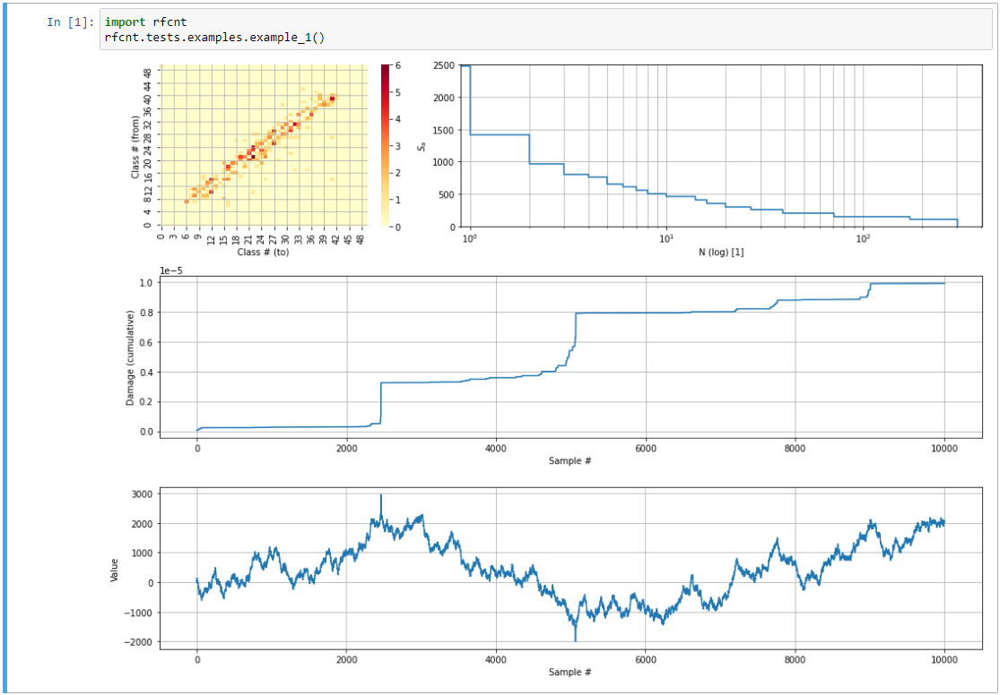

## **rfcnt** a rainflow counting algorithm Python package
  
### "Rainflow Counting" consists of four main steps:

  1. Hysteresis Filtering 
  2. Peak-Valley Filtering 
  3. Discretization 
  4. Four Point Counting Method: 

                     * D  
                    / \       Closed, if min(B,C) >= min(A,D) && max(B,C) <= max(A,D)  
             B *<--/          Slope B-C is counted and removed from residue  
              / \ /  
             /   * C  
          \ /  
           * A  

These steps are fully documented in standards such as  
ASTM E1049 "Standard Practices for Cycle Counting in Fatigue Analysis" [1]  
This implementation uses the 4-point algorithm mentioned in [3,4] and the 3-point HCM method proposed in [2] as well as the ASTM E 1049 (2011) standard in [1].
To take the residue into account, you may implement a custom method or use some
predefined functions.
 
### Install
    pip install {packagename}.tar.gz
where _{packagename}_ is the current package release, for example:

    pip install rfcnt-0.3.1.tar.gz

### Test
_rfcnt_ packages include some unit tests, which can be run:

    python -m rfcnt.run_tests
    
### Examples
For a quick introduction you can run and inspect a small example:

    python -m rfcnt.run_examples

---
### References:
[1] "Standard Practices for Cycle Counting in Fatigue Analysis."  
    ASTM Standard E 1049, 1985 (2011). 
    West Conshohocken, PA: ASTM International, 2011.  
[2] "Rainflow - HCM / Ein Hysteresisschleifen-Zaehlalgorithmus auf werkstoffmechanischer Grundlage"  
    U.H. Clormann, T. Seeger  
    1985 TU Darmstadt, Fachgebiet Werkstoffmechanik  
[3] "Zaehlverfahren zur Bildung von Kollektiven und Matrizen aus Zeitfunktionen"  
    FVA-Richtlinie, 2010.  
    [https://fva-net.de/fileadmin/content/Richtlinien/FVA-Richtlinie_Zaehlverfahren_2010.pdf]  
[4] Siemens Product Lifecycle Management Software Inc., 2018.  
    [https://community.plm.automation.siemens.com/t5/Testing-Knowledge-Base/Rainflow-Counting/ta-p/383093]  
